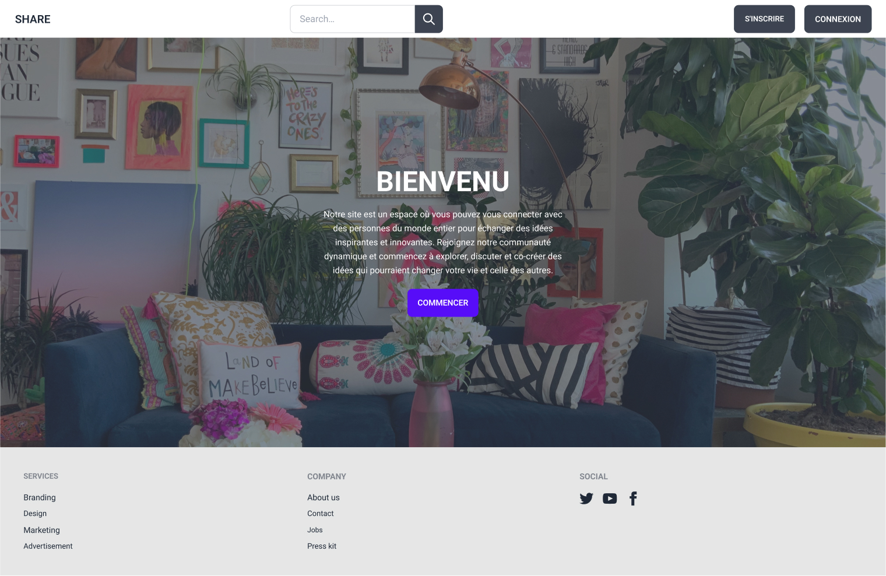

# SHARE-Backend

Share est une application de partage qui permet aux utilisateurs de partager leurs expériences et opinions sur les produits qu'ils ont testés, ainsi que sur d'autres sujets qui les intéressent. Cette application est construite avec Node.js, Express.js, MongoDB et d'autres technologies.

## Installation

1. Cloner ce dépôt :

git clone https://github.com/Madjda-Rezig/SHARE-Frontend.git

2.Accéder au répertoire du projet :

cd share

3.Installer les dépendances :

npm install

4.Créer un fichier .env à la racine du projet avec les variables d'environnement nécessaires. Vous pouvez vous référer au fichier .env.example pour voir quelles variables sont requises.
